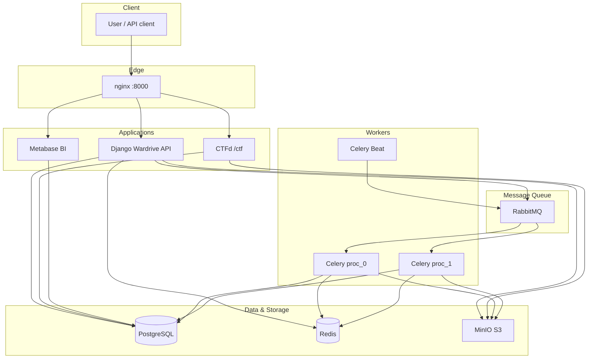

# 🚗📡 Wardriving Conquest --- Overview

This application was developed by **d3vnullv01d** as a *self-hosted
wardriving conquest project*, allowing participants to collect, analyze,
and compete using wireless data gathered from various supported devices.

------------------------------------------------------------------------

# 🏗️ Architecture



------------------------------------------------------------------------

# ⚖️📜 Disclaimer / Legal Notice

This project was created **exclusively for educational purposes** and as
part of an **academic contest**.
Its goal is to teach controlled wireless data collection and analysis
while promoting ethical learning and healthy competition.

## ⚠️ Important

-   Using this application **outside an educational or contest
    environment** may violate local, national, or international laws
    related to privacy, cybersecurity, and telecommunications.
-   The creators are **not responsible** for misuse, damages, or any
    illegal activities performed with this software.
-   The objective is to provide a **controlled, ethical, and
    supervised** environment for practice and learning.

By using this software, the user acknowledges that any unauthorized
usage is **entirely their own responsibility**.

------------------------------------------------------------------------

# 🛠️ Tech Stack

Quick overview of the technologies used:

-   🧱 **Containers** (Docker, Podman)
-   🐍 **Python + Django + Django REST Framework**
-   ⚙️ **Celery + Celery Beat** for parallel file processing
-   🏗️ Easy deployment with Docker Compose or Podman Compose

**Additional documentation (English):** [`docs/PROJECT_SCAN_WARDRIVE.md`](docs/PROJECT_SCAN_WARDRIVE.md), [`docs/METABASE_PROXY_FIX.md`](docs/METABASE_PROXY_FIX.md), [`docs/BUGS_AND_BAD_PRACTICES.md`](docs/BUGS_AND_BAD_PRACTICES.md), [`docs/STATIC_MEDIA_MINIO_PLAN.md`](docs/STATIC_MEDIA_MINIO_PLAN.md), [`PROMPT_ANALYTICS.md`](PROMPT_ANALYTICS.md).

------------------------------------------------------------------------

# 📡 Supported Technologies, Formats & Hardware

## 🔧 Wireless Technologies

Compatible firmwares supported by this application:

-   **WiFi:** RF Village MX, Marauder ESP32, Minino, Wardriver UK
-   **BLE:** Marauder ESP32
-   **LTE:** RF Village MX

> 💡 *Want to request support for an additional technology?*
> Open an Issue and include the header format so it can be added in a
> future release.

------------------------------------------------------------------------

## 📄 Accepted Formats

Supported formats are documented in:

    wardrive/apps/files/utils.py

You may also upload logs following:

-   Wigle WiFi format
-   Minino device outputs

Both are directly compatible with the processing system.

------------------------------------------------------------------------

## 📟 Supported Hardware

-   🐾 **Minino:** `minino`
    https://github.com/ElectronicCats/Minino

-   🐉 **ESP32 Marauder:**
    Options: `flipper dev board`, `flipper dev board pro`,
    `marauder v4`, `marauder v6`, `flipper bffb`, `marauder esp32`, `wardriver uk`, `kiisu dev board`
    https://github.com/justcallmekoko/ESP32Marauder

-   📶 **LILYGO T-SIM7000G-16MB (custom firmware)**
    Options: `rf custom firmware wifi`, `rf custom firmware lte`
    *(Firmware not provided --- happy hacking!)*

------------------------------------------------------------------------

# 📊 BI / Dashboard Preview


**SQL File:** D00

------------------------------------------------------------------------


**SQL Files:** D01, D02, D03

------------------------------------------------------------------------


**SQL Files:** D04, D05

------------------------------------------------------------------------

# 🚀 Initial Deployment

Create your `.env` file:

``` bash
SECRET_KEY=""
DEBUG=""
CORS_ORIGIN_ALLOW_ALL=True
SWAGGER_USE_SESSION_AUTH=True
ENVIRONMENT=local
DB_HOST=wardrive_db
DB_PORT=5432
DB_NAME=postgres
DB_USER=postgres
DB_PASSWORD=postgres
DB_ENGINE="django.db.backends.postgresql"
SWAGGER_EMAIL=""
SWAGGER_AUTHOR="d3vnullv01d"
SWAGGER_CONTACT_URL=""
REDIS_HOST=redis
REDIS_PORT=6379
REDIS_DB=0
CELERY_BROKER_URL=redis://redis:6379/0
CELERY_RESULT_BACKEND=redis://redis:6379/0
FORCE_SCRIPT_NAME=/wardriving
```

Frontend event branding and texts can be configured with `VITE_*` variables.
For container builds (Docker/Podman compose), use the **root** `.env` as source of truth.
For local frontend dev (`bun run dev`), you can optionally use `frontend/.env`.

```bash
VITE_APP_TITLE=Wardriving CTF
VITE_APP_FAVICON_URL=https://example.com/assets/favicon.ico
VITE_EVENT_HOME_TITLE=Platform Home
VITE_EVENT_HOME_BADGE=Event
VITE_EVENT_INTRO_TEXT=Welcome to the platform for our wardriving CTF event.\nHere you can upload captures, review analytics, explore maps, and export KML files.
VITE_EVENT_DYNAMICS_TITLE=Event Dynamics
VITE_EVENT_DYNAMICS_TEXT=1) Collect samples with supported devices.\n2) Upload your files in the Upload section.\n3) Review findings in Maps and Analytics.\n4) Export KML from KML Downloads.
VITE_EVENT_LOGO_SECTION_TITLE=Event Branding
VITE_EVENT_LOGO_SECTION_TEXT=Use this area to display your logo and official links.\nThis content is fully configurable by environment variables.
VITE_EVENT_LOGO_URL=https://example.com/assets/event-logo.png
VITE_EVENT_LOGO_ALT=Wardriving CTF logo
VITE_EVENT_LOGO_LINK_URL=https://example.com/ctf
VITE_EVENT_LOGO_LINK_LABEL=Open Event Website
```

Notes:
- Use `\n` in env values to render line breaks in the Home page dynamics text.
- `VITE_APP_TITLE` and `VITE_APP_FAVICON_URL` are applied at runtime in the frontend.
- In compose-based deployments, `VITE_*` values are injected at image build time via `build.args`.

Start the services:

``` bash
podman-compose up --build -d
```

Create the superuser:

``` bash
podman-compose exec wardrive python wardrive/manage.py createsuperuser
```

Enable the instance required to process files:

``` bash
podman-compose exec wardrive python wardrive/manage.py shell
```

``` python
from apps.files.models import AllowToLoadData
AllowToLoadData.objects.create()
```

Upload logs through DRF:

    POST $BASE_URL/wardriving/api/v1/files-uploaded/

``` json
{
    "device_source": "",
    "uploaded_by": "your nickname here",
    "files": ["file1.log", "file2.log"]
}
```

## Flipper Zero / Marauder ESP32 logs

Uploads processed by `process_file_marauder_esp32` (Flipper Dev Board, Flipper Dev Board Pro, Kiisu board, and classic Marauder hardware via other `device_source` values) support **automatic format detection**:

- **Classic CSV (often with header `StartingWardrive. Stop with stopscan`)** — lines look like `MAC,SSID,[auth],timestamp,channel,rssi,lat,lon,alt,acc,WIFI|BLE` without a leading `N |` index. WiFi and BLE use the same pattern; a `Device:`-prefixed BLE line with the MAC glued to the label is handled when needed.
- **Indexed Flipper lines (often with header `Starting Wardrive. Stop with stopscan`)** — lines start with `N |` (optional leading `>`); WiFi may omit an inline timestamp (`...[auth],,channel,...`). The processor tries BLE, indexed WiFi, V3 WiFi, then classic CSV as a fallback.

You do not need separate uploads per format: **`process_format_flipper_marauder_v2`** picks the strategy from the preamble and/or the first data lines.

### Celery queues and large log processing

- **`CELERY_SHARDS`** (default `2` in code; set in `.env`) defines how many RabbitMQ queues exist (`proc_0` … `proc_{N-1}`). **Run at least one worker per queue** you define: e.g. `docker-compose.yml` ships `celery_proc_0` and `celery_proc_1` listening on `proc_0` and `proc_1`, so keep `CELERY_SHARDS=2` unless you add more worker services.
- File ingestion runs in `apps.files.tasks.process_file`. Large Marauder logs spend time in **line parsing** and **bulk upsert** to PostgreSQL. At **INFO**, logs include `marauder_core parse=…` and `bulk_upsert_by_keys` timings (dedupe, select, classify, write) to compare bottlenecks. Upserts use **row-`IN`** lookups on PostgreSQL and a **partial index** (`wardriving_up_mac_ch_alv` on `uploaded_by`, `mac`, `channel` for non-deleted rows); writes are split into **transactions of up to 5000 keys** by default to shorten lock duration.

------------------------------------------------------------------------

# 🗺️ KML Downloads (WiFi / LTE)

Authenticated users can download KML files for their own scans.

## API endpoints

- `GET /wardriving/api/v1/wardrive/wifi/kml/`
- `GET /wardriving/api/v1/wardrive/lte/kml/`

Query parameters (same semantics as the list endpoints):

- **`first_seen_after`** (required): ISO 8601; the server normalizes to the **start** of that calendar day in the timezone of the value (or `TIME_ZONE` if the value is naive).
- **`first_seen_before`** (required): ISO 8601; normalized to the **end** of that calendar day in the same way.
- **`uploaded_by`** (optional): optional extra filter (icontains), same as list.

Example:

- `/wardriving/api/v1/wardrive/wifi/kml/?first_seen_after=2025-01-01T00:00:00Z&first_seen_before=2025-01-31T23:59:59Z`

Both endpoints:

- Require JWT authentication.
- Require **`first_seen_after` and `first_seen_before`** (otherwise **`400`**) to keep exports bounded and avoid proxy timeouts.
- Export data filtered by `uploaded_by == request.user.username`, plus any optional filters above.
- Return `404` with a clear message when there is no data to export for that range.

## Frontend flow

- The **Home** menu item is the platform landing page.
- The **KML Downloads** menu item provides:
  - **Download WiFi KML**
  - **Download LTE KML**
- Errors (including empty queryset) are shown in-page.

## Map pagination

- Map endpoints use a dedicated pagination policy:
  - default `page_size=1000`
  - max `page_size=2000`
- The map UI loads **1000 points per view** as **four parallel requests** of **250** (`page` advances by 4 per “map page”: pages `(P-1)*4+1` … `(P-1)*4+4`).
- Optional filters: `uploaded_by`, `first_seen_after`, `first_seen_before` (date bounds are normalized server-side to full calendar days in the timezone of each value).
- Example:
  - `/wardriving/api/v1/wardrive/wifi/?page=1&page_size=250&first_seen_after=2025-01-01T00:00:00Z&first_seen_before=2025-12-31T23:59:59Z`
  - `/wardriving/api/v1/wardrive/lte/?page=1&page_size=1500`

------------------------------------------------------------------------

# 📈 Metabase Setup

There is no automatic setup yet.
You must configure it manually:

1.  Go to: `$BASE_METABASE_URL/admin/databases`
2.  Enter the connection values from your `.env`
3.  Create a SQL Query: `+ New > SQL`
4.  Use or customize the queries from: `sql_bi_sources/`

------------------------------------------------------------------------

# 🛑 Ending the Conquest

To stop file processing:

### From the Admin Panel

Edit the `AllowToLoadData` instance and disable it.

### From the Django shell:

``` python
from apps.files.models import AllowToLoadData
AllowToLoadData.objects.get_or_create(active=True)
```

This prevents any new files from being processed.

------------------------------------------------------------------------

# 🙏 Special Thanks

-   [Tyr/@Infrn0](https://www.instagram.com/r3pt1li0)
-   [Harumy/backdoorbabyyy\_](https://github.com/babyyyBugs)
-   [Electronic Cats](https://www.instagram.com/electroniccats/)
-   [Ekoparty (Ekogroup Mx)](https://www.instagram.com/ekogroup_mx/)
-   [misskernel](https://www.instagram.com/misskernel/)
-   [Dr0xharakiri](https://github.com/Dr0xharakiri)
-   [RF Village MX](https://www.instagram.com/rf_village_mx/)
-   And the Mexican Cybersecurity Community 🖤

------------------------------------------------------------------------

# 📌 TODO

-   🏆 Add automatic Metabase setup (scoreboard)
-   🐾 Full support for Minino
-   🕹️ Add new conquest mechanics
-   🔐 Add auth or API key for file upload in production
-   ✏️ Rename `is_procesed` → `is_processed` (migration)

------------------------------------------------------------------------

# 🤝 Want to contribute?

If you want to add support for new hardware or file formats, contact me
through LinkedIn or the email available on my profile.

**Keep learning & happy hacking, pal.** 🐉💻🖤
