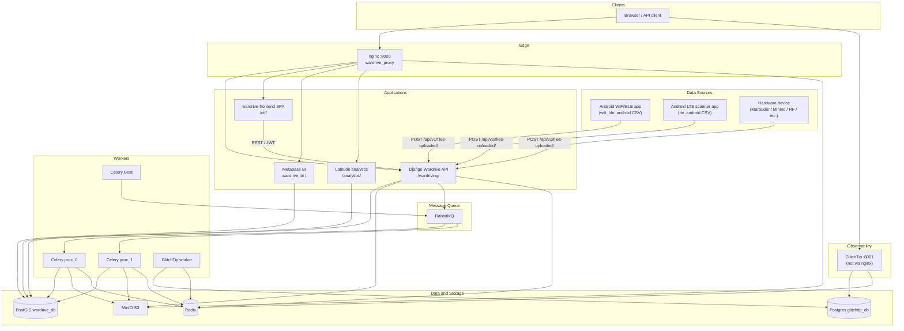
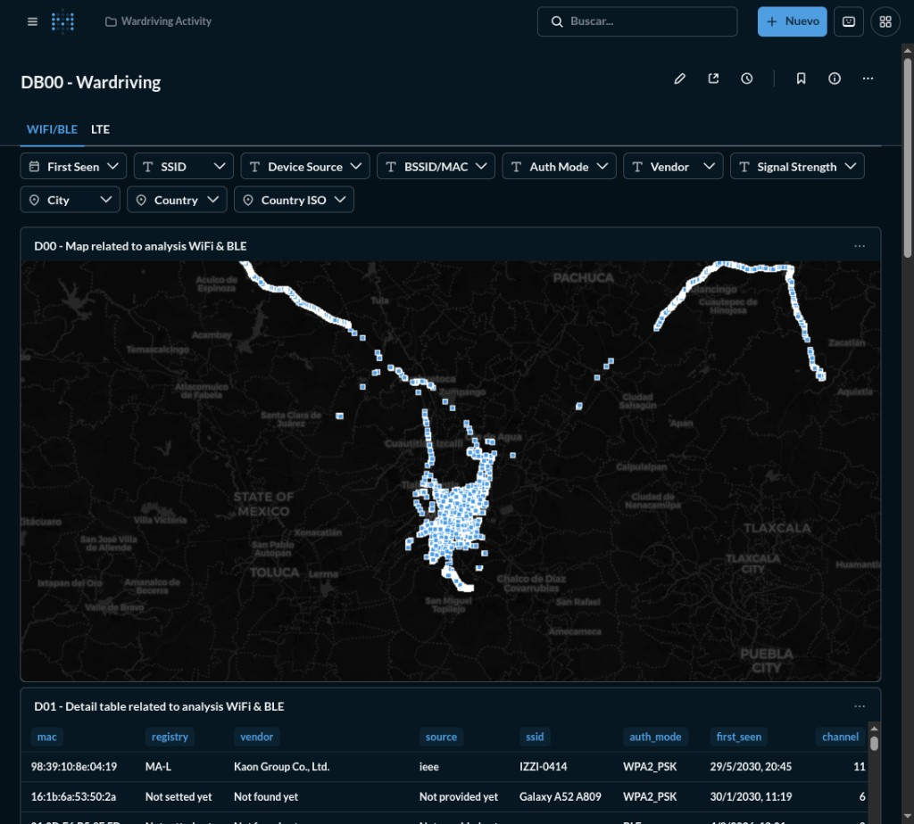
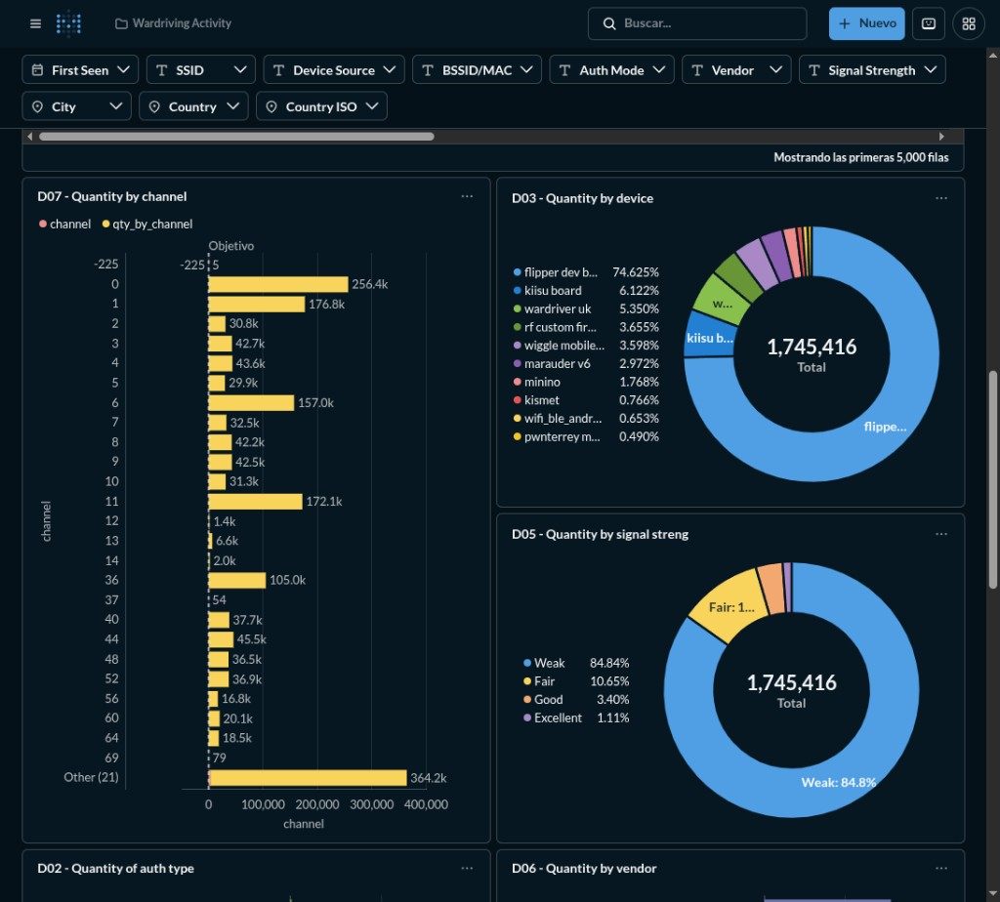
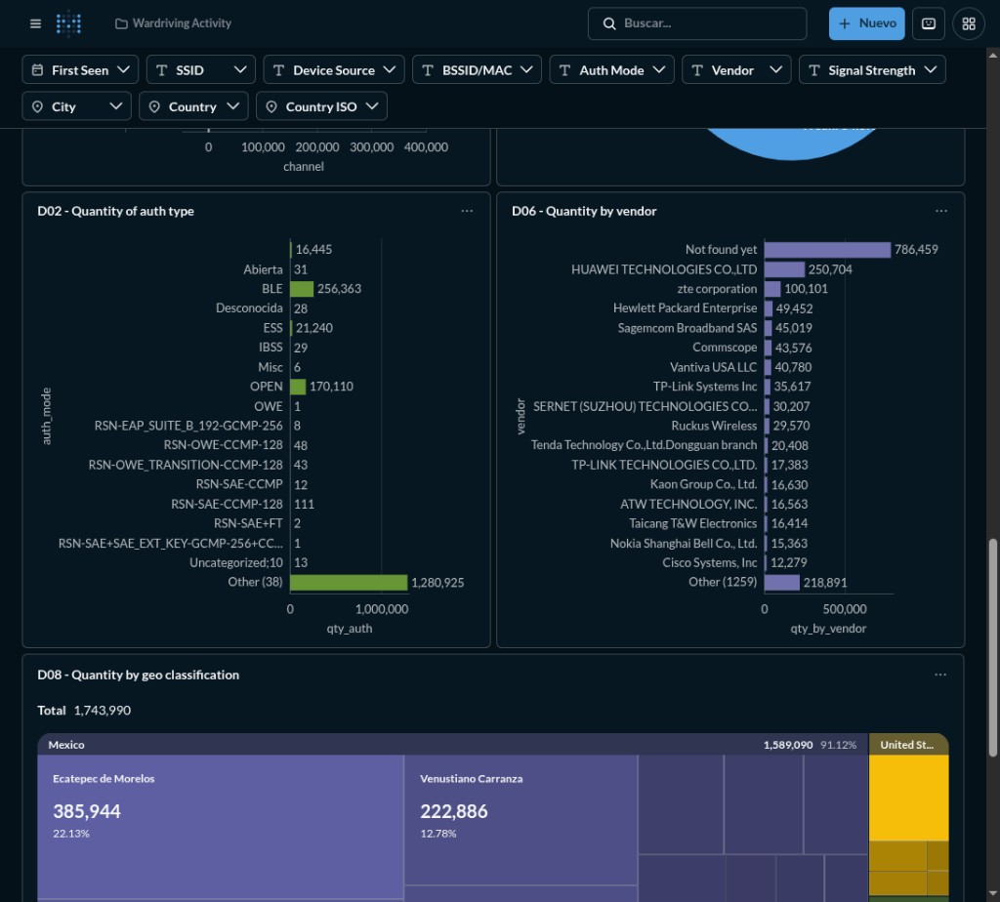
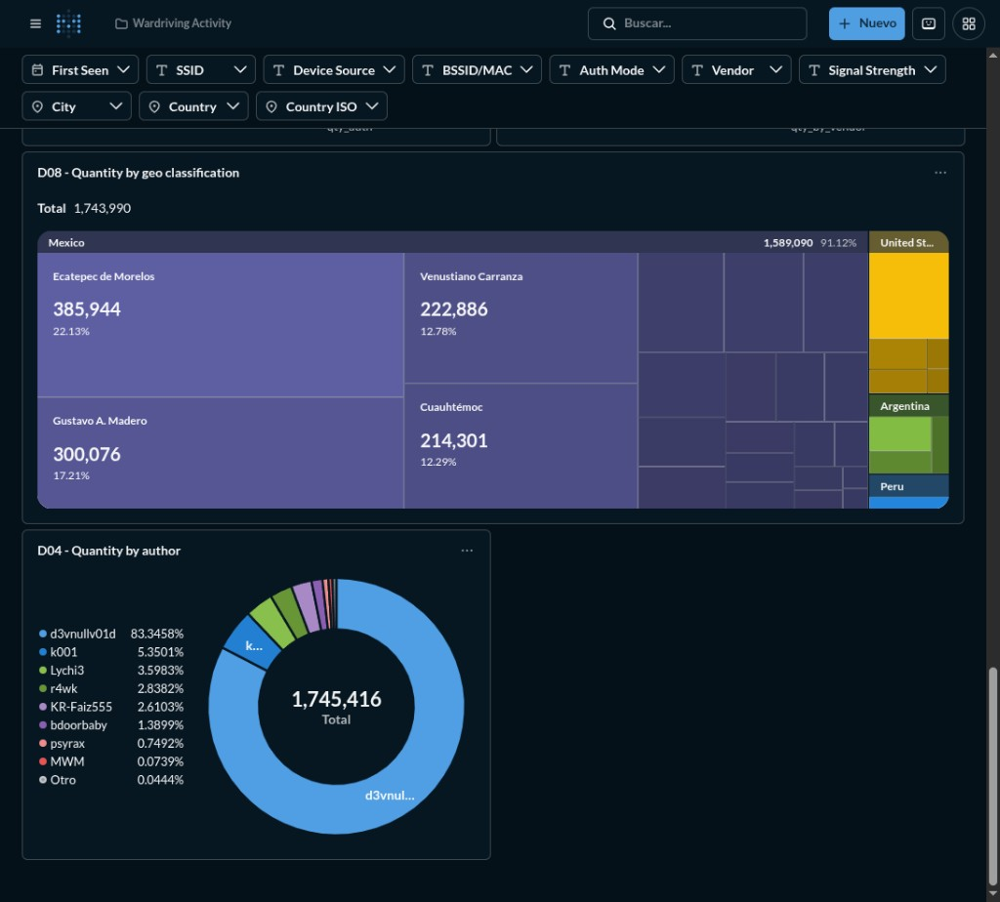
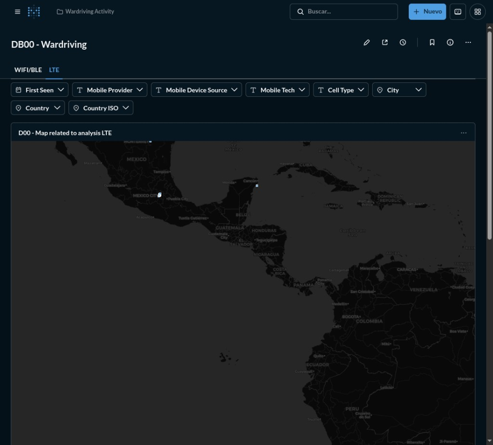
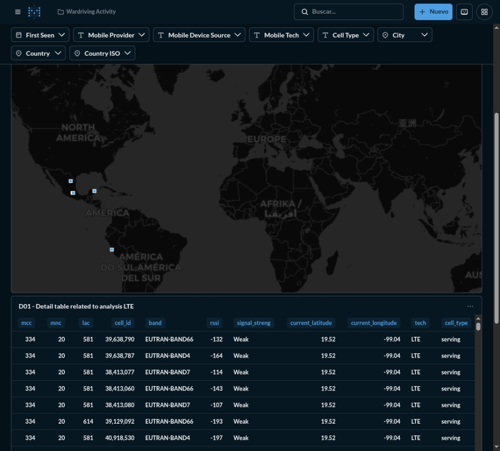

# 🚗📡 Wardriving Conquest --- Overview

This application was developed by **d3vnullv01d** as a *self-hosted
wardriving conquest project*, allowing participants to collect, analyze,
and compete using wireless data gathered from various supported devices.

------------------------------------------------------------------------

# 🏗️ Architecture

Orchestration client: **`podman-compose`** (Compose Spec file may still be named `docker-compose.yml`).


```mermaid
flowchart TB
  subgraph Sources["Data Sources"]
    AndroidWifi["Android WiFi/BLE app\n(wifi_ble_android CSV)"]
    AndroidLTE["Android LTE scanner app\n(lte_android CSV)"]
    HWDevice["Hardware device\n(Marauder / Minino / RF / etc.)"]
  end

  subgraph Clients["Clients"]
    Browser["Browser / API client"]
  end

  subgraph Edge["Edge"]
    Nginx["nginx :8000\nwardrive_proxy"]
  end

  subgraph Applications["Applications"]
    Wardrive["Django Wardrive API\n/wardriving/"]
    Frontend["wardrive-frontend SPA\n/ctf/"]
    Metabase["Metabase BI\nwardrive_bi /"]
    Analytics["Latitude analytics\n/analytics/"]
  end

  subgraph Observability["Observability"]
    GlitchTip["GlitchTip :8001\n(not via nginx)"]
  end

  subgraph Storage["Data and Storage"]
    PG[("PostGIS wardrive_db")]
    GTDB[("Postgres glitchtip_db")]
    Redis[("Redis")]
    MinIO["MinIO S3"]
  end

  subgraph Queue["Message Queue"]
    RabbitMQ["RabbitMQ"]
  end

  subgraph Workers["Workers"]
    Celery0["Celery proc_0"]
    Celery1["Celery proc_1"]
    Beat["Celery Beat"]
    GTWorker["GlitchTip worker"]
  end

  AndroidWifi -->|"POST /api/v1/files-uploaded/"| Wardrive
  AndroidLTE -->|"POST /api/v1/files-uploaded/"| Wardrive
  HWDevice -->|"POST /api/v1/files-uploaded/"| Wardrive

  Browser --> Nginx
  Browser --> GlitchTip
  Nginx --> Wardrive
  Nginx --> Frontend
  Nginx --> Metabase
  Nginx --> Analytics
  Nginx --> MinIO

  Frontend -->|"REST / JWT"| Wardrive

  Wardrive --> PG
  Wardrive --> MinIO
  Wardrive --> RabbitMQ
  Wardrive --> Redis

  Metabase --> PG
  Analytics --> PG
  GlitchTip --> GTDB
  GlitchTip --> Redis
  GTWorker --> GTDB
  GTWorker --> Redis

  RabbitMQ --> Celery0
  RabbitMQ --> Celery1
  Beat --> RabbitMQ

  Celery0 --> PG
  Celery0 --> MinIO
  Celery0 --> Redis
  Celery1 --> PG
  Celery1 --> MinIO
  Celery1 --> Redis
```

## Platform services

| Service (`podman-compose`) | Role | Typical access |
|---|---|---|
| `wardrive_proxy` (nginx) | Reverse proxy / TLS edge at host | `http://<host>:8000` |
| `wardrive` | Django + DRF API, admin, file ingest | `/wardriving/` via nginx |
| `wardrive-frontend` | React/MUI SPA (Bun/Vite build) | `/ctf/` via nginx |
| `wardrive_bi` | Metabase BI (DB00 dashboard, SQL from `sql_bi_sources/`) | `/` Metabase UI via nginx |
| `analytics` | Latitude self/global analytics | `/analytics/` (also bound `:3001`) |
| `wardrive_db` | PostGIS 17 (app data + BI views) | internal |
| `redis` | Cache / Celery / GlitchTip Valkey URL | internal |
| `rabbitmq` | Celery broker (sharded `proc_*` queues) | internal |
| `celery_proc_0` / `celery_proc_1` | File processing workers | internal |
| `celery-beat` | Scheduled Celery tasks | internal |
| `minio` | Object storage (uploads, static) | API via nginx; console `:8081` |
| `glitchtip` + `glitchtip_worker` + `glitchtip_db` | Error tracking | `:8001` (bypasses nginx) |

Canonical SQL for Metabase: [`sql_bi_sources/README.md`](sql_bi_sources/README.md). Demo screenshots: [`demos/README.md`](demos/README.md). BI restore/replica skill: `.cursor/skills/metabase-wardriving-bi/`.

------------------------------------------------------------------------

# ⚖️📜 Disclaimer / Legal Notice

This project was created **exclusively for educational purposes** and as
part of an **academic contest**.
Its goal is to teach controlled wireless data collection and analysis
while promoting ethical learning and healthy competition.

## ⚠️ Important

-   Using this application **outside an educational or contest
    environment** may violate local, national, or international laws
    related to privacy, cybersecurity, and telecommunications.
-   The creators are **not responsible** for misuse, damages, or any
    illegal activities performed with this software.
-   The objective is to provide a **controlled, ethical, and
    supervised** environment for practice and learning.

By using this software, the user acknowledges that any unauthorized
usage is **entirely their own responsibility**.

------------------------------------------------------------------------

# 🛠️ Tech Stack

Quick overview of the technologies used:

-   🧱 **Containers** (Podman + `podman-compose`; Compose Spec file may be `docker-compose.yml`)
-   🐍 **Python + Django + Django REST Framework**
-   ⚙️ **Celery + Celery Beat** for parallel file processing (RabbitMQ queues `proc_*`)
-   📊 **Metabase** (`wardrive_bi`) + **Latitude** analytics + **GlitchTip** error tracking
-   🗃️ **PostGIS**, **Redis**, **MinIO**

**Additional documentation:** [`demos/README.md`](demos/README.md), [`sql_bi_sources/README.md`](sql_bi_sources/README.md), [`docs/PROJECT_SCAN_WARDRIVE.md`](docs/PROJECT_SCAN_WARDRIVE.md), [`docs/METABASE_PROXY_FIX.md`](docs/METABASE_PROXY_FIX.md), [`docs/BUGS_AND_BAD_PRACTICES.md`](docs/BUGS_AND_BAD_PRACTICES.md), [`docs/STATIC_MEDIA_MINIO_PLAN.md`](docs/STATIC_MEDIA_MINIO_PLAN.md), [`docs/ops/postgis_migration.md`](docs/ops/postgis_migration.md), [`PROMPT_ANALYTICS.md`](PROMPT_ANALYTICS.md).

------------------------------------------------------------------------

# 📡 Supported Technologies, Formats & Hardware

## 🔧 Wireless Technologies

Compatible firmwares and data sources supported by this application:

-   **WiFi:** RF Village MX, Marauder ESP32, Minino, Wardriver UK, Android apps (`wifi_ble_android`)
-   **BLE:** Marauder ESP32, Android apps (`wifi_ble_android` — rows without channel are discarded)
-   **LTE:** RF Village MX, Android LTE scanner apps (`lte_android`)

> 💡 *Want to request support for an additional technology?*
> Open an Issue and include the header format so it can be added in a
> future release.

------------------------------------------------------------------------

## 📄 Accepted Formats

Supported formats are documented in:

    wardrive/apps/files/utils.py

You may also upload logs following:

-   **WiGLE WiFi CSV (e.g. v1.4)** — first line is metadata (`WigleWifi-1.4`, often with `appRelease=ESP32Marauder`); the **next** line is the header row (`MAC`, `SSID`, `AuthMode`, `FirstSeen`, `Channel`, `RSSI`, `CurrentLatitude`, `CurrentLongitude`, `AltitudeMeters`, `AccuracyMeters`, `Type`). When uploading, set **`device_source`** to **`minino`** or **`rf custom firmware wifi`** so the CSV is read with `skiprows=1` and the correct column mapping (`apps.process.minino` / `apps.process.rf`). **Do not** use **`marauder esp32`** or other Flipper/Marauder log options for this file type: those run `process_file_marauder_esp32`, which expects **line-based wardrive logs**, not a WiGLE spreadsheet export.
-   Minino device outputs (same CSV shape as above; also available as **`pwnterrey marauder`** in this project when you want event-specific labeling while reusing the Minino processor).
-   **Android WiFi/BLE CSV (`wifi_ble_android`)** — exported from Android wardriving apps. The header is on **line 1** (no metadata line), same WiGLE column layout: `MAC, SSID, AuthMode, FirstSeen, Channel, RSSI, CurrentLatitude, CurrentLongitude, AltitudeMeters, AccuracyMeters, Type`. BLE rows without a `Channel` value are **discarded** (not persisted).
-   **Android LTE CSV (`lte_android`)** — exported from Android LTE/cell scanner apps. Extended 22-column Spanish format: `Timestamp, Tecnología, TipoCelda, Estado, MCC, MNC, LAC, CellID, eNodeB, Sector, PCI, Banda, EARFCN, FreqDL_MHz, FreqUL_MHz, RSSI, RSRP, RSRQ, SINR, Operador, Longitud, Latitud`. The legacy 15-column English format (`Timestamp, Technology, State, MCC, MNC, LAC, CellID, Band, RSSI, RSRP, RSRQ, SINR, Operator, Longitude, Latitude`) is still accepted for backwards compatibility. Placeholder/unserved rows (`CellID=268435455`, `LAC=65535`, `MCC=0`, or no GPS fix) are automatically filtered out.

All WiGLE-style CSV paths above are directly compatible with the processing system.

------------------------------------------------------------------------

## 📟 Supported Hardware

-   🐾 **Minino:** `minino`
    https://github.com/ElectronicCats/Minino

-   🎯 **Pwnterrey Marauder (event CSV):** `pwnterrey marauder` — same WiGLE-style CSV pipeline as Minino; use for exports whose first line is `WigleWifi-…`.

-   🐉 **ESP32 Marauder:**
    Options: `flipper dev board`, `flipper dev board pro`,
    `marauder v4`, `marauder v6`, `flipper bffb`, `marauder esp32`, `wardriver uk`, `kiisu dev board`
    https://github.com/justcallmekoko/ESP32Marauder

-   📶 **LILYGO T-SIM7000G-16MB (custom firmware)**
    Options: `rf custom firmware wifi`, `rf custom firmware lte`
    *(Firmware not provided --- happy hacking!)*

-   📱 **Android WiFi/BLE scanner apps** (e.g. WiGLE WiFi): `wifi_ble_android`
    CSV export with header on line 1 (`MAC, SSID, AuthMode, FirstSeen, Channel, RSSI, CurrentLatitude, CurrentLongitude, AltitudeMeters, AccuracyMeters, Type`).
    BLE rows without a `Channel` are discarded automatically.

-   📡 **Android LTE/cell scanner apps**: `lte_android`
    Extended 22-column Spanish format: `Timestamp, Tecnología, TipoCelda, Estado, MCC, MNC, LAC, CellID, eNodeB, Sector, PCI, Banda, EARFCN, FreqDL_MHz, FreqUL_MHz, RSSI, RSRP, RSRQ, SINR, Operador, Longitud, Latitud`.
    The legacy 15-column English format is still accepted for backwards compatibility.
    Placeholder rows (`CellID=268435455`, `LAC=65535`, `MCC=0`) and rows without GPS coordinates are filtered automatically.

------------------------------------------------------------------------

# 📊 BI / Dashboard Preview

Catalog of all demo assets: [`demos/README.md`](demos/README.md).  
SQL sources: [`sql_bi_sources/wardriving_normal/`](sql_bi_sources/wardriving_normal/) (WiFi/BLE) and [`sql_bi_sources/wardriving_movil/`](sql_bi_sources/wardriving_movil/) (LTE).

## DB00 — WIFI/BLE



**SQL:** D00 map, D01 detail table — view `wardriving_vendor`

------------------------------------------------------------------------



**SQL:** D07 channel, D03 device, D05 signal strength

------------------------------------------------------------------------



**SQL:** D02 auth type, D06 vendor, D08 geo

------------------------------------------------------------------------



**SQL:** D08 geo, D04 author

## DB00 — LTE



**SQL:** D00 map — view `wardriving_mobile` (Band / provider / tech / cell type filters)

------------------------------------------------------------------------



**SQL:** D00 map, D01 detail table

## Legacy stills (kept)


------------------------------------------------------------------------

# 🚀 Initial Deployment

Create your `.env` file:

``` bash
SECRET_KEY=""
DEBUG=""
CORS_ORIGIN_ALLOW_ALL=True
SWAGGER_USE_SESSION_AUTH=True
ENVIRONMENT=local
DB_HOST=wardrive_db
DB_PORT=5432
DB_NAME=postgres
DB_USER=postgres
DB_PASSWORD=postgres
DB_ENGINE="django.contrib.gis.db.backends.postgis"
SWAGGER_EMAIL=""
SWAGGER_AUTHOR="d3vnullv01d"
SWAGGER_CONTACT_URL=""
REDIS_HOST=redis
REDIS_PORT=6379
REDIS_DB=0
CELERY_BROKER_URL=redis://redis:6379/0
CELERY_RESULT_BACKEND=redis://redis:6379/0
FORCE_SCRIPT_NAME=/wardriving
```

Frontend event branding and texts can be configured with `VITE_*` variables.
For container builds (Docker/Podman compose), use the **root** `.env` as source of truth.
For local frontend dev (`bun run dev`), you can optionally use `frontend/.env`.

```bash
VITE_APP_TITLE=Wardriving CTF
VITE_APP_FAVICON_URL=https://example.com/assets/favicon.ico
VITE_EVENT_HOME_TITLE=Platform Home
VITE_EVENT_HOME_BADGE=Event
VITE_EVENT_INTRO_TEXT=Welcome to the platform for our wardriving CTF event.\nHere you can upload captures, review analytics, explore maps, and export KML files.
VITE_EVENT_DYNAMICS_TITLE=Event Dynamics
VITE_EVENT_DYNAMICS_TEXT=1) Collect samples with supported devices.\n2) Upload your files in the Upload section.\n3) Review findings in Maps and Analytics.\n4) Export KML from KML Downloads.
VITE_EVENT_LOGO_SECTION_TITLE=Event Branding
VITE_EVENT_LOGO_SECTION_TEXT=Use this area to display your logo and official links.\nThis content is fully configurable by environment variables.
VITE_EVENT_LOGO_URL=https://example.com/assets/event-logo.png
VITE_EVENT_LOGO_ALT=Wardriving CTF logo
VITE_EVENT_LOGO_LINK_URL=https://example.com/ctf
VITE_EVENT_LOGO_LINK_LABEL=Open Event Website
```

Notes:
- Use `\n` in env values to render line breaks in the Home page dynamics text.
- `VITE_APP_TITLE` and `VITE_APP_FAVICON_URL` are applied at runtime in the frontend.
- In compose-based deployments, `VITE_*` values are injected at image build time via `build.args`.

Start the services:

``` bash
podman-compose up --build -d
```

Create the superuser:

``` bash
podman-compose exec wardrive python wardrive/manage.py createsuperuser
```

Enable the instance required to process files:

``` bash
podman-compose exec wardrive python wardrive/manage.py shell
```

``` python
from apps.files.models import AllowToLoadData
AllowToLoadData.objects.create()
```

Upload logs through DRF:

    POST $BASE_URL/wardriving/api/v1/files-uploaded/

``` json
{
    "device_source": "",
    "uploaded_by": "your nickname here",
    "files": ["file1.log", "file2.log"]
}
```

## WiGLE WiFi CSV vs Marauder logs

| `device_source` | Use for |
| --- | --- |
| `minino`, `rf custom firmware wifi`, `pwnterrey marauder` | WiGLE-style CSV (`WigleWifi-…` on line 1, column header on line 2). |
| `wifi_ble_android` | WiGLE-style CSV from Android apps — header on **line 1** (no metadata line). |
| `lte_android` | LTE/cell CSV from Android scanner apps — extended 22-column Spanish format (legacy 15-column English also accepted), no metadata line. |
| Flipper / Marauder / Kiisu / Kismet / Wardriver UK values | **Wardrive log** files (line-oriented exports), **not** WiGLE CSV spreadsheets. |

## Flipper Zero / Marauder ESP32 logs

Uploads processed by `process_file_marauder_esp32` (Flipper Dev Board, Flipper Dev Board Pro, Kiisu board, and classic Marauder hardware via other `device_source` values) support **automatic format detection**:

- **Classic CSV (often with header `StartingWardrive. Stop with stopscan`)** — lines look like `MAC,SSID,[auth],timestamp,channel,rssi,lat,lon,alt,acc,WIFI|BLE` without a leading `N |` index. WiFi and BLE use the same pattern; a `Device:`-prefixed BLE line with the MAC glued to the label is handled when needed.
- **Indexed Flipper lines (often with header `Starting Wardrive. Stop with stopscan`)** — lines start with `N |` (optional leading `>`); WiFi may omit an inline timestamp (`...[auth],,channel,...`). The processor tries BLE, indexed WiFi, V3 WiFi, then classic CSV as a fallback.

You do not need separate uploads per format: **`process_format_flipper_marauder_v2`** picks the strategy from the preamble and/or the first data lines.

### Celery queues and large log processing

- **`CELERY_SHARDS`** (default `2` in code; set in `.env`) defines how many RabbitMQ queues exist (`proc_0` … `proc_{N-1}`). **Run at least one worker per queue** you define: e.g. `podman-compose` / `docker-compose.yml` ships `celery_proc_0` and `celery_proc_1` listening on `proc_0` and `proc_1`, so keep `CELERY_SHARDS=2` unless you add more worker services.
- File ingestion runs in `apps.files.tasks.process_file`. Large Marauder logs spend time in **line parsing** and **bulk upsert** to PostgreSQL. At **INFO**, logs include `marauder_core parse=…` and `bulk_upsert_by_keys` timings (dedupe, select, classify, write) to compare bottlenecks. Upserts use **row-`IN`** lookups on PostgreSQL and a **partial index** (`wardriving_up_mac_ch_alv` on `uploaded_by`, `mac`, `channel` for non-deleted rows); writes are split into **transactions of up to 5000 keys** by default to shorten lock duration.

------------------------------------------------------------------------

# 🗺️ KML Downloads (WiFi / LTE)

Authenticated users can download KML files for their own scans.

## API endpoints

- `GET /wardriving/api/v1/wardrive/wifi/kml/`
- `GET /wardriving/api/v1/wardrive/lte/kml/`

Query parameters (same semantics as the list endpoints):

- **`first_seen_after`** (required): ISO 8601; the server normalizes to the **start** of that calendar day in the timezone of the value (or `TIME_ZONE` if the value is naive).
- **`first_seen_before`** (required): ISO 8601; normalized to the **end** of that calendar day in the same way.
- **`uploaded_by`** (optional): optional extra filter (icontains), same as list.

Example:

- `/wardriving/api/v1/wardrive/wifi/kml/?first_seen_after=2025-01-01T00:00:00Z&first_seen_before=2025-01-31T23:59:59Z`

Both endpoints:

- Require JWT authentication.
- Require **`first_seen_after` and `first_seen_before`** (otherwise **`400`**) to keep exports bounded and avoid proxy timeouts.
- Export data filtered by `uploaded_by == request.user.username`, plus any optional filters above.
- Return `404` with a clear message when there is no data to export for that range.

## Frontend flow

- The **Home** menu item is the platform landing page.
- The **KML Downloads** menu item provides:
  - **Download WiFi KML**
  - **Download LTE KML**
- Errors (including empty queryset) are shown in-page.

## Map pagination

- Map endpoints use a dedicated pagination policy:
  - default `page_size=1000`
  - max `page_size=2000`
- The map UI loads **1000 points per view** as **four parallel requests** of **250** (`page` advances by 4 per “map page”: pages `(P-1)*4+1` … `(P-1)*4+4`).
- Optional filters: `uploaded_by`, `first_seen_after`, `first_seen_before` (date bounds are normalized server-side to full calendar days in the timezone of each value).
- Example:
  - `/wardriving/api/v1/wardrive/wifi/?page=1&page_size=250&first_seen_after=2025-01-01T00:00:00Z&first_seen_before=2025-12-31T23:59:59Z`
  - `/wardriving/api/v1/wardrive/lte/?page=1&page_size=1500`

------------------------------------------------------------------------

# 📈 Metabase Setup

There is no fully automatic provisioner yet. Manual steps:

1. Open Metabase via nginx (or the `wardrive_bi` service) and go to **Admin → Databases**.
2. Point Metabase at `wardrive_db` (same PostGIS used by Django) using values from `.env`, then **Sync schema**.
3. Confirm views `wardriving_vendor` and `wardriving_mobile` (from Django `apps.misc` view migrations).
4. Create or update native questions from [`sql_bi_sources/`](sql_bi_sources/) — keep `{{template-tags}}` as **field filters** (`type: dimension`). Do **not** rewrite cards with tools that collapse tags to plain text (see [`sql_bi_sources/README.md`](sql_bi_sources/README.md)).
5. Dashboard **DB00 - Wardriving**: tabs **WIFI/BLE** and **LTE**, multi-search dashboard filters, mappings to template-tag names.

For a fresh host, follow the Cursor skill **`metabase-wardriving-bi`** (project: `.cursor/skills/metabase-wardriving-bi/`).

------------------------------------------------------------------------

# 🛑 Ending the Conquest

To stop file processing:

### From the Admin Panel

Edit the `AllowToLoadData` instance and disable it.

### From the Django shell:

``` python
from apps.files.models import AllowToLoadData
AllowToLoadData.objects.get_or_create(active=True)
```

This prevents any new files from being processed.

------------------------------------------------------------------------

# 🙏 Special Thanks

-   [Pwnterrey](https://www.instagram.com/pwnterrey/)
-   [Unknown Security Conference](https://www.instagram.com/unknowncon.pe/)
-   [Pwn3d](https://www.instagram.com/pwn3dcon/)
-   [Harumy/backdoorbabyyy\_](https://github.com/babyyyBugs)
-   [Tyr/@Infrn0](https://www.instagram.com/r3pt1li0)
-   [Wero](https://github.com/wero1414)
-   [Electronic Cats](https://www.instagram.com/electroniccats/)
-   [RF Village MX](https://www.instagram.com/rf_village_mx/)
-   And Latam Cybersecurity Community 🖤

------------------------------------------------------------------------

# 📌 TODO

-   🏆 Add automatic Metabase setup (scoreboard)
-   🕹️ Add new conquest mechanics
-   Support new RF / IoT / Wireless misc technologies / Firmwares support

------------------------------------------------------------------------

# 🤝 Want to contribute?

If you want to add support for new hardware or file formats, contact me
through LinkedIn or the email available on my profile.

**Keep learning & happy hacking, pal.** 🐉💻🖤
